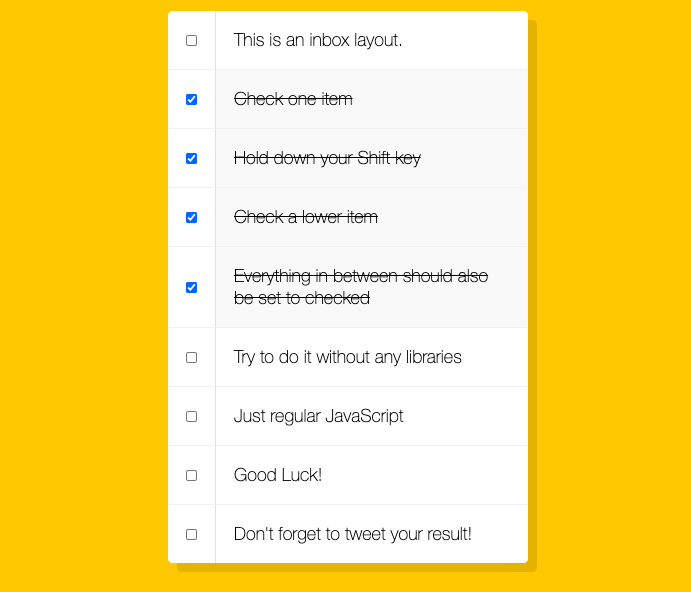

# checkboxes

##  Repository: 
[checkboxes](https://github.com/TBragg800/checkboxes)

##  Deployed:
[checkboxes](https://tbragg800.github.io/checkboxes/)

## Table of Contents
  [Description](#Description)

  [Usage](#Usage)

  [License](#License)

  [Questions](#Questions)
  
## Description
  This is an application created by following the Javascript 30 instruction series by Wes Bos. The purpose of the exercise is to 
  . To find out more about the instruction series visit the site at [Wes Bos JavaScript 30](https://javascript30.com/)

## Installation
  Simply clone the repo locally.

## Usage
  Either open the index.html file in the browser of your choice or visit the github pages hosted application at [checkboxes](https://tbragg800.github.io/checkboxes/)

## License
  MIT License

Copyright (c) [2020] [Thomas Bragg]

Permission is hereby granted, free of charge, to any person obtaining a copy
of this software and associated documentation files (the "Software"), to deal
in the Software without restriction, including without limitation the rights
to use, copy, modify, merge, publish, distribute, sublicense, and/or sell
copies of the Software, and to permit persons to whom the Software is
furnished to do so, subject to the following conditions:

The above copyright notice and this permission notice shall be included in all
copies or substantial portions of the Software.

THE SOFTWARE IS PROVIDED "AS IS", WITHOUT WARRANTY OF ANY KIND, EXPRESS OR
IMPLIED, INCLUDING BUT NOT LIMITED TO THE WARRANTIES OF MERCHANTABILITY,
FITNESS FOR A PARTICULAR PURPOSE AND NONINFRINGEMENT. IN NO EVENT SHALL THE
AUTHORS OR COPYRIGHT HOLDERS BE LIABLE FOR ANY CLAIM, DAMAGES OR OTHER
LIABILITY, WHETHER IN AN ACTION OF CONTRACT, TORT OR OTHERWISE, ARISING FROM,
OUT OF OR IN CONNECTION WITH THE SOFTWARE OR THE USE OR OTHER DEALINGS IN THE
SOFTWARE.

## Questions
  All questions should be submitted to the email listed below. Please consult the GitHub profile or Repo for additional concerns. 
  Email: tbbragg83@gmail.com
  Github: [TBragg800](http://github.com/TBragg800)

## Screenshot of deployed application

